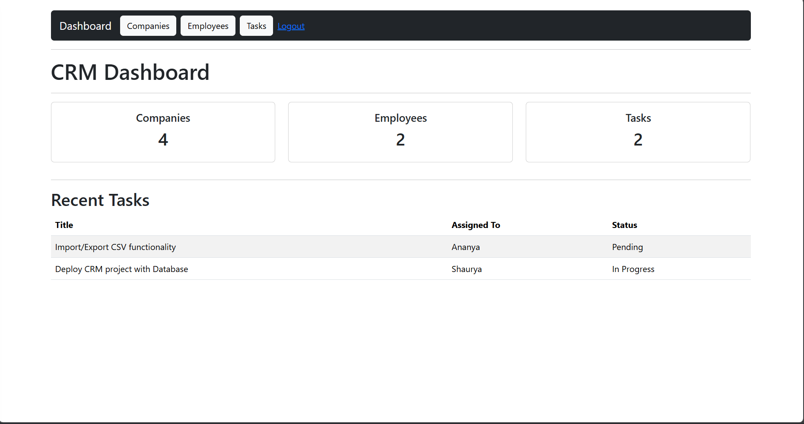
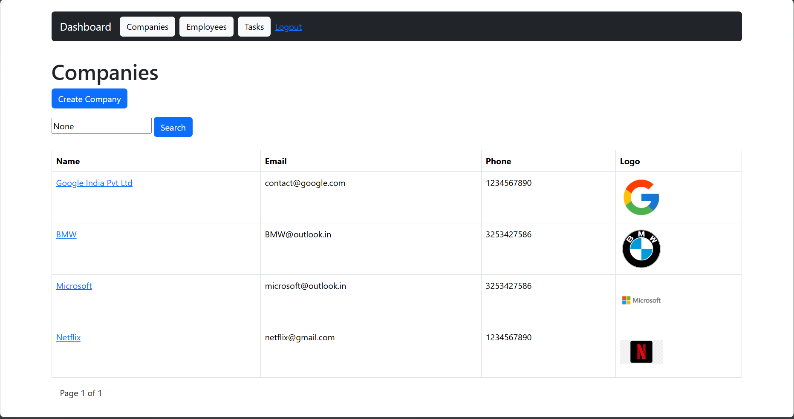
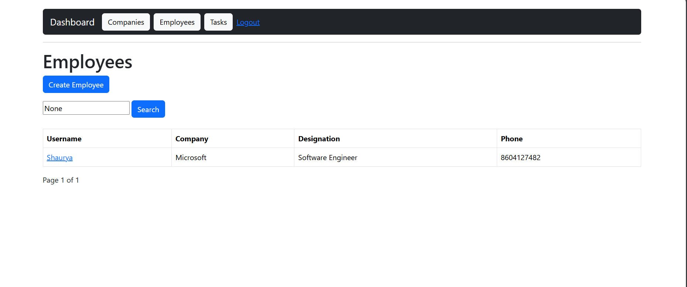
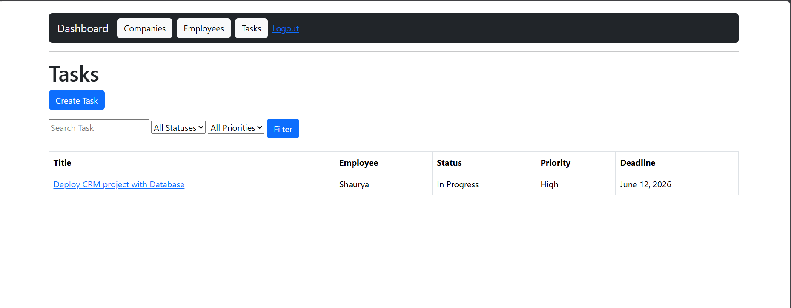
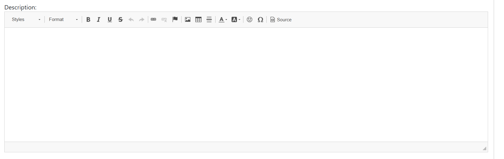

# <p align="center">🚀 Django CRM System</p>

<p align="center">
  <b>Role-Based Customer Relationship Management Platform built with Django & PostgreSQL</b>
</p>

<p align="center">


</p>

<p align="center">


</p>

---

<p align="center">


</p>

---

# 🌐 Live Demo

### Production URL

[](https://django-crm-system-yegs.onrender.com)

---

# 📖 Project Overview

Django CRM System is a full-stack Customer Relationship Management platform designed to manage companies, employees, and tasks through a secure role-based workflow.

The application demonstrates real-world Django development concepts including:

* Authentication & Authorization
* Role-Based Access Control
* PostgreSQL Integration
* File Upload Handling
* CKEditor Integration
* Search & Filtering
* Production Deployment
* Environment Variables
* CI/CD Workflow

---

# ✨ Core Features

### 🛡 Role-Based Access Control

* Admin → Full Access
* Manager → Manage Companies & Tasks
* Employee → View Assigned Tasks

---

### 🏢 Company Management

* Create Companies
* Update Company Details
* Company Logo Upload
* Company Search
* Pagination Support
* Slug-Based URLs

---

### 👨‍💼 Employee Management

* Create Employees
* Employee Profiles
* Company Assignment
* Profile Image Upload
* CRUD Operations

---

### 📋 Task Management

* Create Tasks
* Assign Tasks to Employees
* Status Tracking
* Priority Levels
* File Attachments
* Deadlines
* Rich Text Descriptions

---

### 📊 Dashboard

* Total Companies
* Total Employees
* Total Tasks
* Recent Tasks
* Personalized Employee Dashboard

---

### ⚠️ Error Handling

* Custom 403 Page
* Custom 404 Page
* Form Validation
* Permission Protection

---

# 📈 Project Statistics

| Metric           | Value        |
| ---------------- | ------------ |
| Models           | 3            |
| CRUD Modules     | 3            |
| User Roles       | 3            |
| Database         | PostgreSQL   |
| Authentication   | Django Auth  |
| Rich Text Editor | CKEditor     |
| Deployment       | Render       |
| Version Control  | Git + GitHub |

---

# 🏗 System Architecture

```text
Browser
   │
   ▼
Render
   │
   ▼
Gunicorn
   │
   ▼
Django Application
   │
   ▼
Django ORM
   │
   ▼
PostgreSQL Database
```

---

# 🔄 Application Workflow

```text
Admin
   │
   ├── Creates Companies
   │
   ├── Creates Employees
   │
   └── Assigns Tasks
            │
            ▼
        Employee
            │
            ▼
     Updates Task Status
```

---

# 🗄 Database Design

```text
Company
   │
   │ 1:N
   ▼
Employee
   │
   │ 1:N
   ▼
Task
```

---

# 📸 Application Preview

## Dashboard



---

## Companies Module



---

## Employees Module



---

## Tasks Module



---

## CKEditor Integration



---

# 🛠 Technology Stack

## Backend

* Python 3
* Django 6

## Database

* PostgreSQL

## Frontend

* HTML5
* CSS3
* Bootstrap 5
* Django Templates

## Packages

* django-ckeditor
* psycopg2-binary
* Pillow
* WhiteNoise
* python-dotenv
* Gunicorn

## Deployment

* Render
* GitHub
* PostgreSQL

---

# 📂 Project Structure

```text
crm_project/
│
├── crm/
│   ├── migrations/
│   ├── templates/
│   ├── templatetags/
│   ├── forms.py
│   ├── models.py
│   ├── views.py
│   └── urls.py
│
├── crm_project/
│   ├── settings.py
│   ├── urls.py
│   └── wsgi.py
│
├── media/
├── staticfiles/
├── requirements.txt
├── Procfile
├── manage.py
└── README.md
```

---

# 🚀 Installation Guide

## Clone Repository

```bash
git clone https://github.com/Shaurya-thinker/django-crm-system.git
cd django-crm-system
```

## Create Virtual Environment

```bash
python -m venv env
```

## Activate Environment

### Windows

```bash
env\Scripts\activate
```

## Install Dependencies

```bash
pip install -r requirements.txt
```

## Configure Environment Variables

Create a `.env` file:

```env
SECRET_KEY=your_secret_key

DEBUG=True

DB_NAME=crm_db
DB_USER=postgres
DB_PASSWORD=your_password
DB_HOST=localhost
DB_PORT=5432
```

## Apply Migrations

```bash
python manage.py migrate
```

## Create Superuser

```bash
python manage.py createsuperuser
```

## Run Development Server

```bash
python manage.py runserver
```

---

# 🌍 Deployment

The application is deployed using:

* Render Web Service
* PostgreSQL Database
* WhiteNoise Static Files
* Gunicorn WSGI Server
* GitHub Auto Deploy

### CI/CD Flow

```text
Code Changes
      │
      ▼
Git Push
      │
      ▼
GitHub Repository
      │
      ▼
Render Auto Deploy
      │
      ▼
Production Website
```

---

# 🎯 Key Concepts Demonstrated

### Django

* Models
* Views
* Templates
* Forms
* Authentication
* Authorization
* Custom Decorators

### Database

* PostgreSQL
* ORM Relationships
* Migrations

### Production

* Environment Variables
* Static Files
* WhiteNoise
* Gunicorn
* Render Deployment

### Software Engineering

* Git
* GitHub
* CI/CD
* Documentation
* Project Structuring

---

# 🚀 Future Enhancements

* Cloudinary Integration
* REST API using DRF
* Email Notifications
* Activity Logs
* Docker Support
* AWS Deployment
* Analytics Dashboard
* Team Collaboration Features

---

# 📚 Learning Outcomes

This project helped me gain hands-on experience with:

* Django Authentication
* Role-Based Authorization
* PostgreSQL Integration
* CKEditor Integration
* CRUD Operations
* File Upload Handling
* Production Deployment
* GitHub Workflow
* Environment Variables
* CI/CD Concepts

---

## 👨‍💻 Author

**Shaurya Vrat Shukla**

Python Developer | Django Developer | AI/ML Enthusiast

GitHub: https://github.com/Shaurya-thinker

LinkedIn: https://www.linkedin.com/in/shaurya-vrat-shukla/


---

<p align="center">
⭐ If you found this project interesting, consider giving it a star.
</p>


